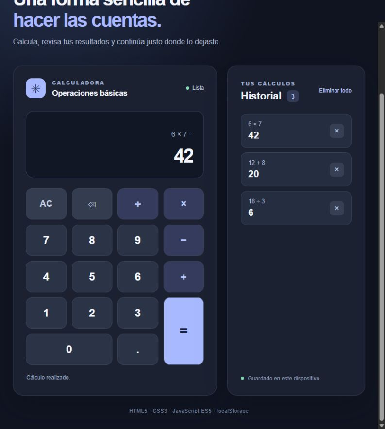

# Calculadora web

Calculadora hecha para la **Tarea 2** con HTML5, CSS3 y JavaScript ES5. Permite sumar, restar, multiplicar y dividir. Cada operación terminada con `=` se añade a un historial que se conserva en el navegador mediante `localStorage` hasta que el usuario la elimine.

## Captura de la página

## Cómo usarla

1. Abre `index.html` en un navegador moderno.
2. Introduce un número, elige una operación, introduce el segundo número y pulsa `=`.
3. Consulta los resultados en el panel de historial. Usa la `×` de una operación para quitarla o **Eliminar todo** para vaciar el historial.

También funciona con el teclado: números, `+`, `-`, `*`, `/`, punto o coma decimal, `Enter` para calcular, `Backspace` para borrar un dígito y `Escape` para reiniciar la pantalla. La calculadora muestra un aviso si se intenta dividir entre cero.

## Archivos

| Archivo | Función |
| --- | --- |
| `index.html` | Estructura de la calculadora y el historial. |
| `styles.css` | Diseño y adaptación a pantallas pequeñas. |
| `app.js` | Operaciones, controles y almacenamiento del historial. |
| `img/calculadora.png` | Captura de la página usada en este README. |

El historial se guarda solo en el navegador y dispositivo donde se usa la página. No requiere instalar dependencias ni iniciar sesión.
